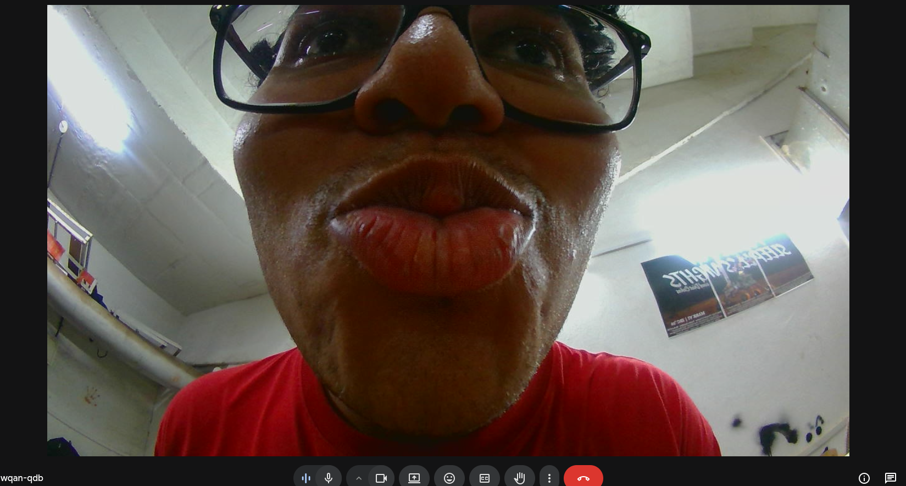
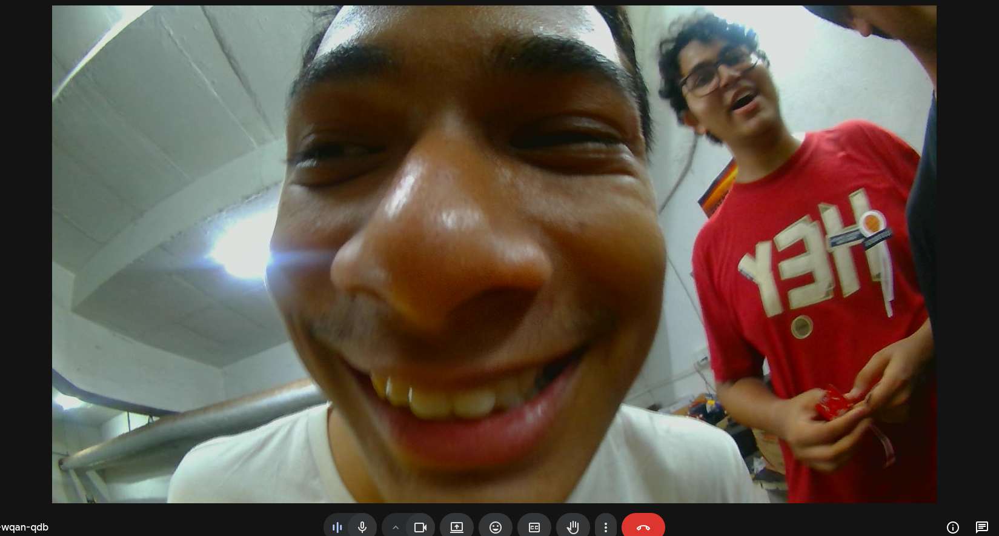

# Technical Developer Documentation: `CameraWidget` & Streaming Pipeline

This document provides a deep, technical breakdown of the Kratos GUI camera streaming implementation. It outlines exact ROS message types, thread execution contexts, memory boundaries, and Qt Widget lifecycles to enable deep-level maintenance and refactoring.

## 1. Threading & Execution Constraints

The streaming system enforces rigid thread separation to avoid blocking the Qt GUI main event loop:
1. **Main UI Thread:** Manages `MainWindow`, `CameraWidget`, `GridCell` layouts, and `VideoPlayerWidget` repaints.
2. **ROS Thread (`rosThread_`):** Manages `RosWorker`, handling `rclcpp::spin_some` and asynchronous service futures.
3. **Dedicated Video Threads (`videoThread_`):** *Every running stream* spawns a dedicated `QThread` housing a `VideoWorker` instance to isolate the `gst_app_sink_pull_sample` blocking calls and H.265 software decoding from the GUI.

> [!WARNING]
> Cross-thread communication heavily relies on the Qt Meta-Object system. Complex types like `CameraStatusList` (a `QList<CameraInfo>`) and `QImage` must be registered using `qRegisterMetaType` (done in `mainwindow.cpp`). Emitting these across threads defaults to `Qt::QueuedConnection`, effectively behaving as thread-safe message queues.

---


## 2. ROS 2 Communication Layer (`RosWorker`)

`RosWorker` acts as an isolation layer wrapping an `rclcpp::Node` (`kratos_gui_node`).

### Subscriptions
* **Topic:** `/kratos/available_cameras` 
* **Type:** `kratos_msgs::msg::CameraStreamList`
* **Handling:** Emits the `camerasUpdated(CameraStatusList)` signal on the Qt event bus. Updates UI components holding the current active port and state of each hardware node.

### Asynchronous Services
Start and stop operations invoke the `/kratos/cameras/start_stream` and `stop_stream` services (Types: `kratos_msgs::srv::StartCameraStream` and `StopCameraStream`). 
* The worker implements `async_send_request` with a lambda callback capturing the future.
* The lambda executes when the Orin replies and emits `serviceResult(bool success, QString message)` securely over the Qt bus. 

---

## 3. GStreamer H.265 Pipeline & Memory Safe-Handoff (`VideoWorker`)

When `VideoPlayerWidget::switchStream` is called, it fires a queued `startPipeline` invocation to the `VideoWorker`. 

### The Low-Latency Pipeline
The built pipeline explicitly expects UDP transport to bypass TCP congestion handling, targeting Jetson hardware using `nvv4l2h265enc` on the sender side:
```bash
udpsrc port=%1
! application/x-rtp,media=video,encoding-name=H265,payload=96
! rtph265depay
! h265parse
! avdec_h265           # CPU Decoding payload
! videoconvert
! videoscale
! video/x-raw,width=1280,height=720,format=RGB
! appsink name=sink emit-signals=true sync=false
```
> [!IMPORTANT]
> The `sync=false` attribute on the appsink is mandatory for achieving zero-latency streaming. It dictates that the element ignores the internal GstClock timestamps and pushes frames to the application the exact microsecond decoding completes.

### Memory Mapping & `GstBuffer` Extraction
The `appsink` triggers the static callback `VideoWorker::onNewSample()`.
1. **Extraction:** A `GstSample` is pulled via `gst_app_sink_pull_sample`. The internal `GstCaps` are parsed via `gst_video_info_from_caps` to dynamically determine the stride, width, and height.
2. **Buffer Mapping:** `gst_buffer_map(buffer, &mapInfo, GST_MAP_READ)` grants read-only access to the raw RGB payload.
3. **Memory Isolation:** 
   ```cpp
   QImage frame(mapInfo.data, width, height, GST_VIDEO_INFO_PLANE_STRIDE(&info, 0), QImage::Format_RGB888);
   QImage copied = frame.copy(); // DEEP COPY
   ```
   *Crucial mechanism:* The `QImage` constructed here points directly to raw `mapInfo.data`. Before unmapping and unreferencing the GStreamer payload, `frame.copy()` forces an allocation and deep memory copy under the Qt heap. This safely decouples the frame's lifetime from GStreamer before it is fired to the GUI Thread via the `newFrame` signal.

---

## 4. UI Grid Reconstruction (`CameraWidget`)

The user controls a dynamic grid of cameras (e.g. going from $1 \times 1$ to $3 \times 3$).

### Grid Rebuild Logic
`CameraWidget::rebuildGrid(int rows, int cols)` triggers a complete tear-down of the existing layout constraints:
1. Iterates over the custom `QVector<GridCell> cells_` struct array.
2. Calls `stopStream()` on any active `VideoPlayerWidget` objects.
3. Completely destroys `gridLayout_` and removes widgets, stripping stretch factors (`setRowStretch(r, 0)`).

### Dropdown Context via Properties
Every `GridCell` contains a `QComboBox` for camera selection. To uniquely identify which cell emitted a change without complex subclasses, it uses Qt Dynamic Properties:
```cpp
picker->setProperty("cellIndex", i);
connect(picker, QOverload<int>::of(&QComboBox::currentIndexChanged), this,
        [this, i](int) { onCellStreamChanged(i); });
```
> [!TIP]
> When `onCamerasUpdated` refreshes the `CameraWidget`, `updateCellDropdowns()` blocks signals (`picker->blockSignals(true)`) before modifying the combos to prevent an infinite cascade of `currentIndexChanged` events. It caches the assigned camera string, rebuilds the list, and uses `setCurrentIndex` to restore state correctly.

---

## 5. Tab Close Lifecycle Warning (`MainWindow`)

> [!CAUTION]
> The tab `closeBtn` uses `QTabBar::RightSide` ownership. When `ui->tabWidget->removeTab(idx)` executes, Qt immediately destroys the `closeBtn`. If `removeTab` is called synchronously inside `closeBtn->clicked()`, the application will suffer a segmentation fault due to destroying the sender during slot execution. 
> 
> *Fix Implementation*: The current architecture delegates the close action via `QTimer::singleShot(0, this, ...)`, effectively deferring destruction until control flow yields to the top of the GUI event loop.
